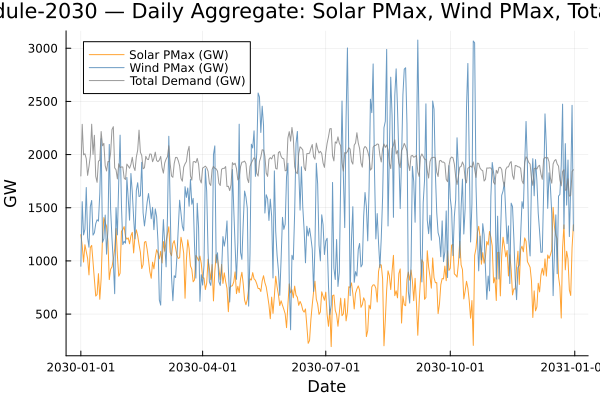

```@meta
EditURL = "../../../../literate/isp2024/tutorials/working_with_pisp_outputs.jl"
```

# ISP 2024: Working with PISP-generated outputs

This tutorial selects one existing PISP output by reference-weather trace, demand probability of exceedance, and planning year, then shows how static tables relate to time-varying schedules.
The default selection is `reftrace = 4006`, `poe = 10`, and `year = 2030`.
Set `PISP_DOCS_ISP2024_REFTRACE`, `PISP_DOCS_ISP2024_POE`, or `PISP_DOCS_ISP2024_YEAR` to select another available combination.

## Prerequisites and selected build

The ISP 2024 documentation profile identifies the dataset parent and default selection.
The code first lists available `out-ref<reftrace>-poe<poe>` builds and `schedule-<year>` directories, then checks the five files used below.
Missing inputs fail before any aggregation or plotting begins.

| Evidence | Role in this tutorial |
|---|---|
| `Generator.csv` | Static generator identity, technology, and bus assignment |
| `Demand.csv` | Static demand identity and bus assignment |
| `Bus.csv` | Bus-to-NEM-area mapping |
| `Generator_pmax_sched.csv` | Time-varying maximum available generator output |
| `Demand_load_sched.csv` | Time-varying demand load |

## Output relationships

The workflow joins generator and demand schedules back to their static definitions, then aggregates daily solar PMax, wind PMax, and total demand series.
`Generator_pmax_sched.csv` is an availability or maximum-output schedule; it is not realised dispatch or observed generation.

```@raw html
<details class="source-code"><summary>Show source code</summary>
```

````julia
ENV["GKSwstype"] = "100"

using CSV
using DataFrames
using Dates
using Plots

gr();

const REPO_ROOT = normpath(get(ENV, "PISP_DOCS_REPO_ROOT", joinpath(@__DIR__, "..", "..", "..", "..")))

include(joinpath(REPO_ROOT, "docs", "utils", "PISPDocUtils.jl"))
import .PISPDocUtils

const ISP2024_PROFILE = PISPDocUtils.edition_profile(REPO_ROOT, "2024")
const OUTPUT_ROOT = ISP2024_PROFILE.output_root
OUTPUT_ROOT === nothing && error(
    "ISP 2024 profile does not define output_root; set PISP_DOCS_ISP2024_OUTPUT_ROOT to an existing output CSV directory.",
)
const DEFAULT_BUILD_MATCH = match(r"^out-ref(\d+)-poe(\d+)$", basename(dirname(OUTPUT_ROOT)))
DEFAULT_BUILD_MATCH === nothing && error(
    "ISP 2024 output_root must end in out-ref<reftrace>-poe<poe>/csv: $(OUTPUT_ROOT)",
)
const DEFAULT_SCHEDULE_MATCH = match(r"^schedule-(\d+)$", something(ISP2024_PROFILE.schedule_tag, ""))
DEFAULT_SCHEDULE_MATCH === nothing && error(
    "ISP 2024 schedule_tag must use schedule-<year>: $(ISP2024_PROFILE.schedule_tag)",
)

function integer_selection(variable, default)
    value = get(ENV, variable, string(default))
    parsed = tryparse(Int, value)
    parsed === nothing && error("$variable must be an integer, received $(repr(value))")
    return parsed
end

const REFTRACE = integer_selection("PISP_DOCS_ISP2024_REFTRACE", parse(Int, DEFAULT_BUILD_MATCH.captures[1]))
const POE = integer_selection("PISP_DOCS_ISP2024_POE", parse(Int, DEFAULT_BUILD_MATCH.captures[2]))
const PLANNING_YEAR = integer_selection("PISP_DOCS_ISP2024_YEAR", parse(Int, DEFAULT_SCHEDULE_MATCH.captures[1]))
const DATASET_ROOT = dirname(dirname(normpath(OUTPUT_ROOT)))
const BUILD_NAME = "out-ref$(REFTRACE)-poe$(POE)"
const DATA_ROOT = joinpath(DATASET_ROOT, BUILD_NAME, "csv")
const SCHEDULE_TAG = "schedule-$(PLANNING_YEAR)"
const SCHEDULE_DIR = joinpath(DATA_ROOT, SCHEDULE_TAG)

available_builds = DataFrame(reftrace = Int[], poe = Int[], folder = String[])
for folder in sort(readdir(DATASET_ROOT))
    matched = match(r"^out-ref(\d+)-poe(\d+)$", folder)
    matched === nothing && continue
    isdir(joinpath(DATASET_ROOT, folder, "csv")) || continue
    push!(available_builds, (parse(Int, matched.captures[1]), parse(Int, matched.captures[2]), folder))
end
nrow(available_builds) > 0 || error("no out-ref<reftrace>-poe<poe> builds found under $(DATASET_ROOT)")
isdir(DATA_ROOT) || error(
    "requested reftrace=$REFTRACE and poe=$POE is unavailable; available builds are $(join(available_builds.folder, ", "))",
)
````

```@raw html
</details>
```

The discovered build folders show which reference-trace and demand-POE combinations are actually available.

```@raw html
<details class="source-code"><summary>Show source code</summary>
```

````julia
PISPDocUtils.markdown_table(available_builds)
````

```@raw html
</details>
```

| **reftrace** | **poe** | **folder** |
|--:|--:|:--|
| 2017 | 10 | out-ref2017-poe10 |
| 2017 | 50 | out-ref2017-poe50 |
| 4006 | 10 | out-ref4006-poe10 |
| 4006 | 50 | out-ref4006-poe50 |


```@raw html
<details class="source-code"><summary>Show source code</summary>
```

````julia
available_schedule_years = Int[]
for folder in readdir(DATA_ROOT)
    matched = match(r"^schedule-(\d+)$", folder)
    matched === nothing && continue
    isdir(joinpath(DATA_ROOT, folder)) || continue
    push!(available_schedule_years, parse(Int, matched.captures[1]))
end
sort!(available_schedule_years)
PLANNING_YEAR in available_schedule_years || error(
    "requested year=$PLANNING_YEAR is unavailable for $BUILD_NAME; available years are $(join(available_schedule_years, ", "))",
)
selection_table = DataFrame(
    Dimension = ["Reference-weather trace", "Demand POE", "Planning year"],
    Value = [REFTRACE, POE, PLANNING_YEAR],
    Folder = [BUILD_NAME, BUILD_NAME, SCHEDULE_TAG],
)
````

```@raw html
</details>
```

The selected tuple resolves to one build folder for static tables and one year-specific schedule folder.

```@raw html
<details class="source-code"><summary>Show source code</summary>
```

````julia
PISPDocUtils.markdown_table(selection_table)
````

```@raw html
</details>
```

| **Dimension** | **Value** | **Folder** |
|:--|--:|:--|
| Reference-weather trace | 4006 | out-ref4006-poe10 |
| Demand POE | 10 | out-ref4006-poe10 |
| Planning year | 2030 | schedule-2030 |


```@raw html
<details class="source-code"><summary>Show source code</summary>
```

````julia
required_files = [
    joinpath(DATA_ROOT, "Generator.csv"),
    joinpath(DATA_ROOT, "Demand.csv"),
    joinpath(DATA_ROOT, "Bus.csv"),
    joinpath(SCHEDULE_DIR, "Generator_pmax_sched.csv"),
    joinpath(SCHEDULE_DIR, "Demand_load_sched.csv"),
]
missing_files = filter(path -> !isfile(path), required_files)
isempty(missing_files) || error("missing PISP output files: $(join(missing_files, ", "))")
````

```@raw html
</details>
```

## Load static tables

`Generator.csv`, `Demand.csv`, and `Bus.csv` are static tables written once per PISP build.

```@raw html
<details class="source-code"><summary>Show source code</summary>
```

````julia
gen_df = CSV.read(joinpath(DATA_ROOT, "Generator.csv"), DataFrame)
dem_df = CSV.read(joinpath(DATA_ROOT, "Demand.csv"), DataFrame)
bus_df = CSV.read(joinpath(DATA_ROOT, "Bus.csv"), DataFrame)

println("=== Generator Table ===")
println("Shape: ", size(gen_df))
println("Columns: ", names(gen_df))
````

```@raw html
</details>
```

````
=== Generator Table ===
Shape: (124, 48)
Columns: ["id_gen", "name", "alias", "fuel", "tech", "type", "capacity", "forate", "fullout", "partialout", "derate", "mttrfull", "mttrpart", "id_bus", "pmin", "pmax", "rup", "rdw", "investment", "active", "cvar", "cfuel", "cvom", "cfom", "co2", "slope", "hrate", "pfrmax", "g", "inertia", "ffr", "pfr", "res2", "res3", "powerfactor", "latitude", "longitude", "n", "contingency", "down_time", "up_time", "last_state", "last_state_period", "last_state_output", "start_up_cost", "shut_down_cost", "start_up_time", "shut_down_time"]

````

Fuel and technology counts show the asset mix represented in the generated output.

```@raw html
<details class="source-code"><summary>Show source code</summary>
```

````julia
fuel_counts = sort(combine(groupby(gen_df, :fuel), nrow => :count), :count; rev = true)
PISPDocUtils.markdown_table(fuel_counts)
````

```@raw html
</details>
```

| **fuel** | **count** |
|:--|--:|
| Natural Gas | 37 |
| Hydro | 30 |
| Solar | 22 |
| Coal | 15 |
| Wind | 11 |
| Diesel | 7 |
| Hydrogen | 2 |


```@raw html
<details class="source-code"><summary>Show source code</summary>
```

````julia
tech_counts = sort(combine(groupby(gen_df, :tech), nrow => :count), :count; rev = true)
PISPDocUtils.markdown_table(tech_counts)
````

```@raw html
</details>
```

| **tech** | **count** |
|:--|--:|
| Reservoir | 28 |
| OCGT | 28 |
| RoofPV | 12 |
| Wind | 11 |
| LargePV | 10 |
| CCGT | 9 |
| Black Coal QLD | 8 |
| Diesel | 7 |
| Black Coal NSW | 4 |
| Brown Coal VIC | 2 |
| Run-of-River | 2 |
| Hydrogen-based gas turbines | 2 |
| Brown Coal | 1 |


## Load schedules

`Generator_pmax_sched.csv` and `Demand_load_sched.csv` are time-varying companion tables for generator maximum available output and demand load.
Maximum available output is a technical limit, not a record of dispatch.

```@raw html
<details class="source-code"><summary>Show source code</summary>
```

````julia
gen_pmax = CSV.read(joinpath(SCHEDULE_DIR, "Generator_pmax_sched.csv"), DataFrame)
dem_load = CSV.read(joinpath(SCHEDULE_DIR, "Demand_load_sched.csv"), DataFrame)

println("\n=== Generator_pmax_sched ===")
println("Shape: ", size(gen_pmax))
println("Columns: ", names(gen_pmax))
````

```@raw html
</details>
```

````

=== Generator_pmax_sched ===
Shape: (867243, 5)
Columns: ["id", "id_gen", "scenario", "date", "value"]

````

The first rows make the schedule schema concrete.

```@raw html
<details class="source-code"><summary>Show source code</summary>
```

````julia
PISPDocUtils.markdown_table(first(gen_pmax, 5))
````

```@raw html
</details>
```

| **id** | **id\_gen** | **scenario** | **date** | **value** |
|--:|--:|--:|:--|--:|
| 1 | 78 | 1 | 2044-07-01T00:00:00 | 106.0 |
| 2 | 78 | 2 | 2044-07-01T00:00:00 | 106.0 |
| 3 | 78 | 3 | 2044-07-01T00:00:00 | 106.0 |
| 4 | 92 | 1 | 2030-01-01T00:00:00 | 0.0 |
| 5 | 92 | 1 | 2030-01-01T01:00:00 | 0.0 |


```@raw html
<details class="source-code"><summary>Show source code</summary>
```

````julia
println("\n=== Demand_load_sched ===")
println("Shape: ", size(dem_load))
````

```@raw html
</details>
```

````

=== Demand_load_sched ===
Shape: (315360, 5)

````

```@raw html
<details class="source-code"><summary>Show source code</summary>
```

````julia
PISPDocUtils.markdown_table(first(dem_load, 5))
````

```@raw html
</details>
```

| **id** | **id\_dem** | **scenario** | **date** | **value** |
|--:|--:|--:|:--|--:|
| 1 | 1 | 1 | 2030-01-01T00:00:00 | 720.249 |
| 2 | 1 | 1 | 2030-01-01T01:00:00 | 695.304 |
| 3 | 1 | 1 | 2030-01-01T02:00:00 | 660.949 |
| 4 | 1 | 1 | 2030-01-01T03:00:00 | 642.355 |
| 5 | 1 | 1 | 2030-01-01T04:00:00 | 636.49 |


## Area and technology context

`Bus.csv` carries `id_area`; joining that onto `Generator.csv` via `id_bus` assigns each generator to a NEM area. Solar and wind are identified from `tech` using case-insensitive substring matches.

```@raw html
<details class="source-code"><summary>Show source code</summary>
```

````julia
area_map = Dict(zip(bus_df.id_bus, bus_df.id_area))
gen_df.area = [area_map[b] for b in gen_df.id_bus]
const AREA_NAMES = Dict(1 => "QLD", 2 => "NSW", 3 => "VIC", 4 => "TAS", 5 => "SA")
gen_df.area_name = [AREA_NAMES[a] for a in gen_df.area]

is_solar(tech) = occursin(r"pv|solar"i, tech)
is_wind(tech) = occursin(r"wind"i, tech)

solar_gens = filter(:tech => is_solar, gen_df)
wind_gens = filter(:tech => is_wind, gen_df)

println("\nSolar generators: ", nrow(solar_gens))
println("Wind generators: ", nrow(wind_gens))
````

```@raw html
</details>
```

````

Solar generators: 22
Wind generators: 11

````

```@raw html
<details class="source-code"><summary>Show source code</summary>
```

````julia
solar_tech_counts = sort(
    combine(groupby(solar_gens, :tech), nrow => :count), :count; rev = true,
)
PISPDocUtils.markdown_table(solar_tech_counts)
````

```@raw html
</details>
```

| **tech** | **count** |
|:--|--:|
| RoofPV | 12 |
| LargePV | 10 |


```@raw html
<details class="source-code"><summary>Show source code</summary>
```

````julia
wind_tech_counts = sort(
    combine(groupby(wind_gens, :tech), nrow => :count), :count; rev = true,
)
PISPDocUtils.markdown_table(wind_tech_counts)
````

```@raw html
</details>
```

| **tech** | **count** |
|:--|--:|
| Wind | 11 |


## Join identifiers

The demand schedule is filtered to demand IDs present in `Demand.csv`. The generator PMax schedule is joined to `Generator.csv` so solar and wind schedules can be separated by technology.

```@raw html
<details class="source-code"><summary>Show source code</summary>
```

````julia
dem_load_full = filter(:id_dem => in(Set(dem_df.id_dem)), dem_load)
dem_load_full.day = Date.(dem_load_full.date)

gen_pmax_ts = innerjoin(gen_pmax, select(gen_df, [:id_gen, :tech]); on = :id_gen)
gen_pmax_ts.day = Date.(gen_pmax_ts.date)

sol_pmax_ts = filter(:tech => is_solar, gen_pmax_ts)
wind_pmax_ts = filter(:tech => is_wind, gen_pmax_ts)
````

```@raw html
</details>
```

## Aggregate daily series

Values are summed by day and converted from MW to GW for plotting.

```@raw html
<details class="source-code"><summary>Show source code</summary>
```

````julia
sol_daily = sort(combine(groupby(sol_pmax_ts, :day), :value => sum => :value), :day)
wind_daily = sort(combine(groupby(wind_pmax_ts, :day), :value => sum => :value), :day)
dem_daily = sort(combine(groupby(dem_load_full, :day), :value => sum => :value), :day)

println(
    "\nDaily aggregate series length — solar: ", nrow(sol_daily),
    ", wind: ", nrow(wind_daily),
    ", demand: ", nrow(dem_daily),
)
````

```@raw html
</details>
```

````

Daily aggregate series length — solar: 365, wind: 365, demand: 365

````

## Selected schedule profiles

The figure compares the daily aggregate schedules in GW.
It should not be read as a supply-demand balance: it omits dispatch decisions, curtailment, storage operation, network constraints, and interchange.

```@raw html
<details class="source-code"><summary>Show source code</summary>
```

````julia
fig = plot(
    sol_daily.day, sol_daily.value ./ 1000;
    label = "Solar PMax (GW)", color = :darkorange, linewidth = 1, alpha = 0.8,
)
plot!(
    fig, wind_daily.day, wind_daily.value ./ 1000;
    label = "Wind PMax (GW)", color = :steelblue, linewidth = 1, alpha = 0.8,
)
plot!(
    fig, dem_daily.day, dem_daily.value ./ 1000;
    label = "Total Demand (GW)", color = :grey, linewidth = 1, alpha = 0.8,
)
xlabel!(fig, "Date")
ylabel!(fig, "GW")
title!(fig, "$(SCHEDULE_TAG) — Daily Aggregate: Solar PMax, Wind PMax, Total Demand")

const SCRIPT_STEM = "isp2024_working_with_pisp_outputs"
const FIGURE_PATH = PISPDocUtils.figure_path(SCRIPT_STEM, "isp2024_working_with_pisp_outputs-timeseries.png")
savefig(fig, FIGURE_PATH)
PISPDocUtils.embed_figure(FIGURE_PATH, "isp2024_working_with_pisp_outputs-timeseries.png")
````

```@raw html
</details>
```



## Validation

- The required-file preflight verifies the selected build before any table is read.
- The printed shapes and first rows expose the static and schedule schemas used by the joins.
- The generator counts verify which records are classified as solar and wind.
- The reported daily-series lengths verify the overlapping date coverage used by the figure.

## Interpret the result

The static-table joins attach technology and bus-area context to otherwise identifier-only schedule rows.
The resulting solar and wind series describe aggregate PMax availability, while the demand series describes aggregate load.
Their co-plotting is useful for coverage and shape checks, but it does not establish dispatch feasibility, adequacy, or energy balance.

## Next use

The same joins can be extended by filtering a scenario, NEM area, technology, or date window before aggregation.
Analyses that require realised operation must use an appropriate dispatch or power-system model rather than treating PMax as generation.
