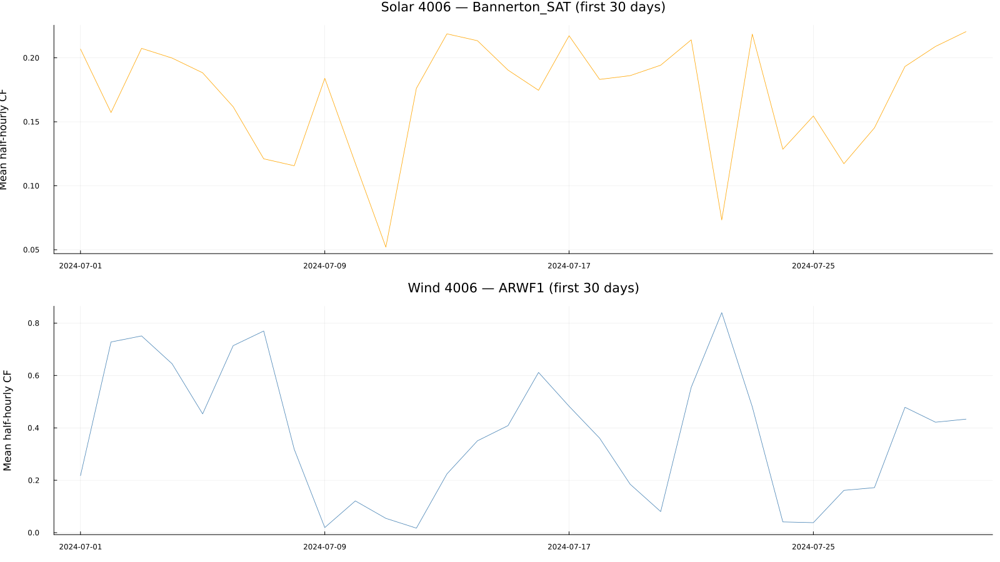

```@meta
EditURL = "../../../../literate/isp2024/validation/workbook_and_trace_structure.jl"
```

# ISP 2024: Workbook and trace structure

ISP 2024 source material combines the inputs and assumptions workbook, the
electric-vehicle workbook, generation and storage outlooks, scenario models,
and trace collections.
The tables below describe their workbook, model-archive, and trace structure.

```@raw html
<details class="source-code"><summary>Show source code</summary>
```

````julia

using CSV
using DataFrames
using Dates
using PISP
using Plots
using Statistics
using XLSX


const REPO_ROOT = normpath(get(ENV, "PISP_DOCS_REPO_ROOT", joinpath(@__DIR__, "..", "..", "..", "..")))
include(joinpath(REPO_ROOT, "docs", "utils", "PISPDocUtils.jl"))
import .PISPDocUtils

const PROFILE = PISPDocUtils.edition_profile(REPO_ROOT, "2024")
const SOURCE_ROWS = DataFrame(PISP.source_spec_rows(2024))

function sheet_matches(pattern, sheets)
    pattern == "*_Numbers" && return any(sheet -> endswith(sheet, "_Numbers"), sheets)
    return pattern in sheets
end

inputs_workbook = joinpath(PROFILE.download_root, "2024-isp-inputs-and-assumptions-workbook.xlsx")
ev_workbook = joinpath(PROFILE.download_root, "2023-iasr-ev-workbook.xlsx")
inputs_sheets = XLSX.openxlsx(inputs_workbook) do workbook
    Set(XLSX.sheetnames(workbook))
end
ev_sheets = XLSX.openxlsx(ev_workbook) do workbook
    Set(XLSX.sheetnames(workbook))
end

input_specs = filter(row -> row.source_format == "xlsx" && row.workbook_or_pattern == basename(inputs_workbook), SOURCE_ROWS)
ev_specs = filter(row -> row.source_format == "xlsx" && row.workbook_or_pattern == basename(ev_workbook), SOURCE_ROWS)
all(row -> sheet_matches(row.worksheet, inputs_sheets), eachrow(input_specs)) || error(
    "the ISP 2024 inputs workbook is missing a documented worksheet",
)
all(row -> sheet_matches(row.worksheet, ev_sheets), eachrow(ev_specs)) || error(
    "the ISP 2024 electric-vehicle workbook is missing a documented worksheet",
)

scenario_names = ["Green Energy Exports", "Progressive Change", "Step Change"]
model_root = joinpath(PROFILE.download_root, "2024 ISP Model")
outlook_root = joinpath(PROFILE.download_root, "Core")
trace_root = joinpath(PROFILE.download_root, "Traces")
scenario_roots = [joinpath(model_root, "2024 ISP $scenario") for scenario in scenario_names]
all(isdir, scenario_roots) || error("the ISP 2024 model archive is missing a scenario directory")
isdir(outlook_root) || error("the ISP 2024 generation and storage outlook directory was not found")
isdir(trace_root) || error("the ISP 2024 trace directory was not found")
````

```@raw html
</details>
```

## Workbook structure

```@raw html
<details class="source-code"><summary>Show source code</summary>
```

````julia
workbook_structure = DataFrame(
    source_collection = [
        "Inputs and assumptions workbook",
        "Electric-vehicle workbook",
        "Generation and storage outlook",
    ],
    files = [
        "2024-isp-inputs-and-assumptions-workbook.xlsx",
        "2023-iasr-ev-workbook.xlsx",
        "Core scenario workbooks",
    ],
    selections = [
        join(sort!(unique(input_specs.worksheet)), ", "),
        join(sort!(unique(ev_specs.worksheet)), ", "),
        "Capacity, Storage Capacity, Storage Energy, and REZ Generation Capacity",
    ],
)
PISPDocUtils.markdown_table(
    workbook_structure;
    column_labels = ["Source collection", "Files", "Selections"],
)
````

```@raw html
</details>
```

| **Source collection** | **Files** | **Selections** |
|:--|:--|:--|
| Inputs and assumptions workbook | 2024-isp-inputs-and-assumptions-workbook.xlsx | DSP, Emissions intensity, Existing Gen Data Summary, Flow Path Augmentation options, GPG Min Stable Level, Generation limits, Generator Reliability Settings, Hydro Scheme Inflows, Max Ramp Rates, Maximum capacity, Min Up&Down Times, Network Capability, Renewable Energy Zones, Retirement, Storage properties, Sub-regional demand allocation, Summary Mapping, Transmission Reliability |
| Electric-vehicle workbook | 2023-iasr-ev-workbook.xlsx | \*\_Numbers, BEV\_PHEV\_Charge\_Type (%), BEV\_PHEV\_Profile\_kW (Weekday), BEV\_PHEV\_Profile\_kW (Weekend) |
| Generation and storage outlook | Core scenario workbooks | Capacity, Storage Capacity, Storage Energy, and REZ Generation Capacity |


## Model archive structure

```@raw html
<details class="source-code"><summary>Show source code</summary>
```

````julia
model_structure = DataFrame(
    source_collection = ["Scenario models", "Model trace folders", "Renewable trace collections"],
    files = [
        join(["2024 ISP $scenario" for scenario in scenario_names], ", "),
        "Traces inside each scenario model",
        "Demand, solar, and wind trace collections",
    ],
    selections = [
        "One scenario directory and model XML file per scenario",
        "Demand, hydro, load-subtracter, solar, timeslice, and wind",
        "Scenario, region or project, reference year, and PoE where applicable",
    ],
)
PISPDocUtils.markdown_table(
    model_structure;
    column_labels = ["Source collection", "Files", "Selections"],
)
````

```@raw html
</details>
```

| **Source collection** | **Files** | **Selections** |
|:--|:--|:--|
| Scenario models | 2024 ISP Green Energy Exports, 2024 ISP Progressive Change, 2024 ISP Step Change | One scenario directory and model XML file per scenario |
| Model trace folders | Traces inside each scenario model | Demand, hydro, load-subtracter, solar, timeslice, and wind |
| Renewable trace collections | Demand, solar, and wind trace collections | Scenario, region or project, reference year, and PoE where applicable |


## Trace schema

```@raw html
<details class="source-code"><summary>Show source code</summary>
```

````julia
trace_specs = filter(row -> row.source_format == "csv", SOURCE_ROWS)
trace_schema = select(
    trace_specs,
    :id => ByRow(id -> titlecase(replace(id, "_" => " "))) => :trace_family,
    :workbook_or_pattern => :file_or_pattern,
    :keys,
    [:columns, :units] => ByRow((columns, units) -> join(filter(value -> !isempty(value), [columns, units]), ". ")) => :fields_units,
)
PISPDocUtils.markdown_table(
    trace_schema;
    column_labels = ["Trace family", "File or pattern", "Keys", "Fields and units"],
)
````

```@raw html
</details>
```

| **Trace family** | **File or pattern** | **Keys** | **Fields and units** |
|:--|:--|:--|:--|
| Distributed Pv Demand Trace | demand\_{subregion}\_{scenario}/{subregion}\_RefYear\_{reference\_year}\_{scenario\_code}\_POE{poe}\_PV\_TOT.csv | Year; Month; Day | Year; Month; Day |
| Existing Solar Trace | solar\_{reference\_year}/{generator\_file} | Year; Month; Day | Year; Month; Day |
| Existing Wind Trace | wind\_{reference\_year}/{generator\_file} | Year; Month; Day | Year; Month; Day |
| Hydro Annual Energy Limit Trace | 2024 ISP {scenario}/Traces/hydro/{file\_name}\_{hydro\_scenario}.csv | Year | Year |
| Hydro Natural Inflow Trace | 2024 ISP {scenario}/Traces/hydro/{file\_name}\_{hydro\_scenario}.csv | Year; Month; Day | Year; Month; Day; Inflows |
| Operational Demand Trace | demand\_{subregion}\_{scenario}/{subregion}\_RefYear\_{reference\_year}\_{scenario\_code}\_POE{poe}\_OPSO\_MODELLING\_PVLITE.csv | Year; Month; Day | Year; Month; Day |
| Reference Year Trace | Traces/{technology}\_{reference\_year}/{trace\_file} | Year; Month; Day | Year; Month; Day |
| Rez Solar Trace | solar\_{reference\_year}/{rez\_trace\_file} | Year; Month; Day | Year; Month; Day |
| Rez Wind Trace | wind\_{reference\_year}/{rez\_trace\_file} | Year; Month; Day | Year; Month; Day |


## Representative trace profiles

The two panels compare representative solar and wind capacity-factor traces
over the first 30 days of reference year 4006.

```@raw html
<details class="source-code"><summary>Show source code</summary>
```

````julia
let
    solar = CSV.read(
        joinpath(trace_root, "solar_4006", "Bannerton_SAT_RefYear4006.csv"),
        DataFrame,
    )
    wind = CSV.read(
        joinpath(trace_root, "wind_4006", "ARWF1_RefYear4006.csv"),
        DataFrame,
    )
    solar_sample = solar[1:30, :]
    wind_sample = wind[1:30, :]
    solar_dates = Date.(solar_sample.Year, solar_sample.Month, solar_sample.Day)
    wind_dates = Date.(wind_sample.Year, wind_sample.Month, wind_sample.Day)
    solar_mean = vec(mean(Matrix(solar_sample[!, 4:51]), dims = 2))
    wind_mean = vec(mean(Matrix(wind_sample[!, 4:51]), dims = 2))
    solar_plot = plot(
        solar_dates,
        solar_mean;
        linewidth = 0.8,
        color = :orange,
        label = "",
        title = "Solar 4006 — Bannerton_SAT (first 30 days)",
        ylabel = "Mean half-hourly CF",
        legend = false,
    )
    wind_plot = plot(
        wind_dates,
        wind_mean;
        linewidth = 0.8,
        color = :steelblue,
        label = "",
        title = "Wind 4006 — ARWF1 (first 30 days)",
        ylabel = "Mean half-hourly CF",
        legend = false,
    )
    figure = plot(
        solar_plot,
        wind_plot;
        layout = (2, 1),
        size = (1600, 900),
        left_margin = 5Plots.mm,
        bottom_margin = 4Plots.mm,
        top_margin = 4Plots.mm,
    )
    figure_path = PISPDocUtils.figure_path( # hide
        "isp2024_workbook_and_trace_structure", # hide
        "01_sample_traces.png", # hide
    ) # hide
    savefig(figure, figure_path) # hide
    PISPDocUtils.embed_figure(figure_path, "01_sample_traces.png") # hide
end
````

```@raw html
</details>
```



## Compare editions

The [raw-source comparison](../../comparison/analyses/raw-source-comparison.md)
compares workbook selections and schemas.
The [model archive comparison](../../comparison/analyses/model-archive-comparison.md)
compares scenario directories, model files, and trace folders.
