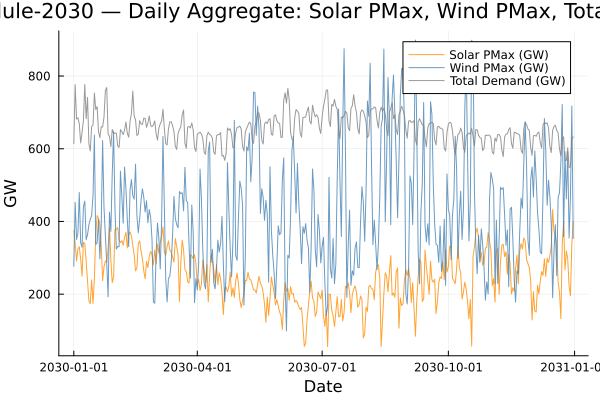

```@meta
EditURL = "../../../literate/tutorials/working_with_pisp_outputs.jl"
```

# Working with PISP-generated outputs

This tutorial loads one local PISP output build and shows how the static tables relate to the time-varying schedules. By default it reads `data/2024/pisp-datasets/out-ref4006-poe10/csv/` and `schedule-2030/`; set `PISP_OUTPUT_ROOT` or `PISP_SCHEDULE_TAG` to use another generated build.

The workflow joins generator and demand schedules back to `Generator.csv`, `Demand.csv`, and `Bus.csv`, then aggregates daily solar PMax, wind PMax, and total demand series.

```@raw html
<details class="source-code"><summary>Show source code</summary>
```

````julia
ENV["GKSwstype"] = "100"

using CSV
using DataFrames
using Dates
using Plots

gr();

const REPO_ROOT = normpath(get(
    ENV,
    "PISP_DOCS_REPO_ROOT",
    joinpath(@__DIR__, "..", "..", ".."),
))
const DATA_ROOT = normpath(get(
    ENV,
    "PISP_OUTPUT_ROOT",
    joinpath(REPO_ROOT, "data", "2024", "pisp-datasets", "out-ref4006-poe10", "csv"),
))
const SCHEDULE_TAG = get(ENV, "PISP_SCHEDULE_TAG", "schedule-2030")
const SCHEDULE_DIR = joinpath(DATA_ROOT, SCHEDULE_TAG)

required_files = [
    joinpath(DATA_ROOT, "Generator.csv"),
    joinpath(DATA_ROOT, "Demand.csv"),
    joinpath(DATA_ROOT, "Bus.csv"),
    joinpath(SCHEDULE_DIR, "Generator_pmax_sched.csv"),
    joinpath(SCHEDULE_DIR, "Demand_load_sched.csv"),
]
missing_files = filter(path -> !isfile(path), required_files)
isempty(missing_files) || error("missing PISP output files: $(join(missing_files, ", "))")
````

```@raw html
</details>
```

````
true
````

## Step 1 — load the static output tables

`Generator.csv`, `Demand.csv`, and `Bus.csv` are static tables written once per PISP build.

```@raw html
<details class="source-code"><summary>Show source code</summary>
```

````julia
gen_df = CSV.read(joinpath(DATA_ROOT, "Generator.csv"), DataFrame)
dem_df = CSV.read(joinpath(DATA_ROOT, "Demand.csv"), DataFrame)
bus_df = CSV.read(joinpath(DATA_ROOT, "Bus.csv"), DataFrame)

println("=== Generator Table ===")
println("Shape: ", size(gen_df))
println("Columns: ", names(gen_df))
````

```@raw html
</details>
```

````
=== Generator Table ===
Shape: (124, 48)
Columns: ["id_gen", "name", "alias", "fuel", "tech", "type", "capacity", "forate", "fullout", "partialout", "derate", "mttrfull", "mttrpart", "id_bus", "pmin", "pmax", "rup", "rdw", "investment", "active", "cvar", "cfuel", "cvom", "cfom", "co2", "slope", "hrate", "pfrmax", "g", "inertia", "ffr", "pfr", "res2", "res3", "powerfactor", "latitude", "longitude", "n", "contingency", "down_time", "up_time", "last_state", "last_state_period", "last_state_output", "start_up_cost", "shut_down_cost", "start_up_time", "shut_down_time"]

````

Fuel and technology counts show the asset mix represented in the generated output.

```@raw html
<details class="source-code"><summary>Show source code</summary>
```

````julia
fuel_counts = sort(combine(groupby(gen_df, :fuel), nrow => :count), :count; rev = true)
````

```@raw html
</details>
```

```@raw html
<div><div style = "float: left;"><span>7×2 DataFrame</span></div><div style = "clear: both;"></div></div><div class = "data-frame" style = "overflow-x: scroll;"><table class = "data-frame" style = "margin-bottom: 6px;"><thead><tr class = "columnLabelRow"><th class = "stubheadLabel" style = "font-weight: bold; text-align: right;">Row</th><th style = "text-align: left;">fuel</th><th style = "text-align: left;">count</th></tr><tr class = "columnLabelRow"><th class = "stubheadLabel" style = "font-weight: bold; text-align: right;"></th><th title = "InlineStrings.String15" style = "text-align: left;">String15</th><th title = "Int64" style = "text-align: left;">Int64</th></tr></thead><tbody><tr class = "dataRow"><td class = "rowLabel" style = "font-weight: bold; text-align: right;">1</td><td style = "text-align: left;">Natural Gas</td><td style = "text-align: right;">37</td></tr><tr class = "dataRow"><td class = "rowLabel" style = "font-weight: bold; text-align: right;">2</td><td style = "text-align: left;">Hydro</td><td style = "text-align: right;">30</td></tr><tr class = "dataRow"><td class = "rowLabel" style = "font-weight: bold; text-align: right;">3</td><td style = "text-align: left;">Solar</td><td style = "text-align: right;">22</td></tr><tr class = "dataRow"><td class = "rowLabel" style = "font-weight: bold; text-align: right;">4</td><td style = "text-align: left;">Coal</td><td style = "text-align: right;">15</td></tr><tr class = "dataRow"><td class = "rowLabel" style = "font-weight: bold; text-align: right;">5</td><td style = "text-align: left;">Wind</td><td style = "text-align: right;">11</td></tr><tr class = "dataRow"><td class = "rowLabel" style = "font-weight: bold; text-align: right;">6</td><td style = "text-align: left;">Diesel</td><td style = "text-align: right;">7</td></tr><tr class = "dataRow"><td class = "rowLabel" style = "font-weight: bold; text-align: right;">7</td><td style = "text-align: left;">Hydrogen</td><td style = "text-align: right;">2</td></tr></tbody></table></div>
```

```@raw html
<details class="source-code"><summary>Show source code</summary>
```

````julia
tech_counts = sort(combine(groupby(gen_df, :tech), nrow => :count), :count; rev = true)
````

```@raw html
</details>
```

```@raw html
<div><div style = "float: left;"><span>13×2 DataFrame</span></div><div style = "clear: both;"></div></div><div class = "data-frame" style = "overflow-x: scroll;"><table class = "data-frame" style = "margin-bottom: 6px;"><thead><tr class = "columnLabelRow"><th class = "stubheadLabel" style = "font-weight: bold; text-align: right;">Row</th><th style = "text-align: left;">tech</th><th style = "text-align: left;">count</th></tr><tr class = "columnLabelRow"><th class = "stubheadLabel" style = "font-weight: bold; text-align: right;"></th><th title = "InlineStrings.String31" style = "text-align: left;">String31</th><th title = "Int64" style = "text-align: left;">Int64</th></tr></thead><tbody><tr class = "dataRow"><td class = "rowLabel" style = "font-weight: bold; text-align: right;">1</td><td style = "text-align: left;">Reservoir</td><td style = "text-align: right;">28</td></tr><tr class = "dataRow"><td class = "rowLabel" style = "font-weight: bold; text-align: right;">2</td><td style = "text-align: left;">OCGT</td><td style = "text-align: right;">28</td></tr><tr class = "dataRow"><td class = "rowLabel" style = "font-weight: bold; text-align: right;">3</td><td style = "text-align: left;">RoofPV</td><td style = "text-align: right;">12</td></tr><tr class = "dataRow"><td class = "rowLabel" style = "font-weight: bold; text-align: right;">4</td><td style = "text-align: left;">Wind</td><td style = "text-align: right;">11</td></tr><tr class = "dataRow"><td class = "rowLabel" style = "font-weight: bold; text-align: right;">5</td><td style = "text-align: left;">LargePV</td><td style = "text-align: right;">10</td></tr><tr class = "dataRow"><td class = "rowLabel" style = "font-weight: bold; text-align: right;">6</td><td style = "text-align: left;">CCGT</td><td style = "text-align: right;">9</td></tr><tr class = "dataRow"><td class = "rowLabel" style = "font-weight: bold; text-align: right;">7</td><td style = "text-align: left;">Black Coal QLD</td><td style = "text-align: right;">8</td></tr><tr class = "dataRow"><td class = "rowLabel" style = "font-weight: bold; text-align: right;">8</td><td style = "text-align: left;">Diesel</td><td style = "text-align: right;">7</td></tr><tr class = "dataRow"><td class = "rowLabel" style = "font-weight: bold; text-align: right;">9</td><td style = "text-align: left;">Black Coal NSW</td><td style = "text-align: right;">4</td></tr><tr class = "dataRow"><td class = "rowLabel" style = "font-weight: bold; text-align: right;">10</td><td style = "text-align: left;">Brown Coal VIC</td><td style = "text-align: right;">2</td></tr><tr class = "dataRow"><td class = "rowLabel" style = "font-weight: bold; text-align: right;">11</td><td style = "text-align: left;">Run-of-River</td><td style = "text-align: right;">2</td></tr><tr class = "dataRow"><td class = "rowLabel" style = "font-weight: bold; text-align: right;">12</td><td style = "text-align: left;">Hydrogen-based gas turbines</td><td style = "text-align: right;">2</td></tr><tr class = "dataRow"><td class = "rowLabel" style = "font-weight: bold; text-align: right;">13</td><td style = "text-align: left;">Brown Coal</td><td style = "text-align: right;">1</td></tr></tbody></table></div>
```

## Step 2 — load the schedule output

`Generator_pmax_sched.csv` and `Demand_load_sched.csv` are time-varying companion tables for generator maximum output and demand load.

```@raw html
<details class="source-code"><summary>Show source code</summary>
```

````julia
gen_pmax = CSV.read(joinpath(SCHEDULE_DIR, "Generator_pmax_sched.csv"), DataFrame)
dem_load = CSV.read(joinpath(SCHEDULE_DIR, "Demand_load_sched.csv"), DataFrame)

println("\n=== Generator_pmax_sched ===")
println("Shape: ", size(gen_pmax))
println("Columns: ", names(gen_pmax))
````

```@raw html
</details>
```

````

=== Generator_pmax_sched ===
Shape: (289083, 5)
Columns: ["id", "id_gen", "scenario", "date", "value"]

````

The first rows make the schedule schema concrete.

```@raw html
<details class="source-code"><summary>Show source code</summary>
```

````julia
first(gen_pmax, 5)
````

```@raw html
</details>
```

```@raw html
<div><div style = "float: left;"><span>5×5 DataFrame</span></div><div style = "clear: both;"></div></div><div class = "data-frame" style = "overflow-x: scroll;"><table class = "data-frame" style = "margin-bottom: 6px;"><thead><tr class = "columnLabelRow"><th class = "stubheadLabel" style = "font-weight: bold; text-align: right;">Row</th><th style = "text-align: left;">id</th><th style = "text-align: left;">id_gen</th><th style = "text-align: left;">scenario</th><th style = "text-align: left;">date</th><th style = "text-align: left;">value</th></tr><tr class = "columnLabelRow"><th class = "stubheadLabel" style = "font-weight: bold; text-align: right;"></th><th title = "Int64" style = "text-align: left;">Int64</th><th title = "Int64" style = "text-align: left;">Int64</th><th title = "Int64" style = "text-align: left;">Int64</th><th title = "Dates.DateTime" style = "text-align: left;">DateTime</th><th title = "Float64" style = "text-align: left;">Float64</th></tr></thead><tbody><tr class = "dataRow"><td class = "rowLabel" style = "font-weight: bold; text-align: right;">1</td><td style = "text-align: right;">1</td><td style = "text-align: right;">78</td><td style = "text-align: right;">1</td><td style = "text-align: left;">2044-07-01T00:00:00</td><td style = "text-align: right;">106.0</td></tr><tr class = "dataRow"><td class = "rowLabel" style = "font-weight: bold; text-align: right;">2</td><td style = "text-align: right;">2</td><td style = "text-align: right;">78</td><td style = "text-align: right;">2</td><td style = "text-align: left;">2044-07-01T00:00:00</td><td style = "text-align: right;">106.0</td></tr><tr class = "dataRow"><td class = "rowLabel" style = "font-weight: bold; text-align: right;">3</td><td style = "text-align: right;">3</td><td style = "text-align: right;">78</td><td style = "text-align: right;">3</td><td style = "text-align: left;">2044-07-01T00:00:00</td><td style = "text-align: right;">106.0</td></tr><tr class = "dataRow"><td class = "rowLabel" style = "font-weight: bold; text-align: right;">4</td><td style = "text-align: right;">4</td><td style = "text-align: right;">92</td><td style = "text-align: right;">2</td><td style = "text-align: left;">2030-01-01T00:00:00</td><td style = "text-align: right;">0.0</td></tr><tr class = "dataRow"><td class = "rowLabel" style = "font-weight: bold; text-align: right;">5</td><td style = "text-align: right;">5</td><td style = "text-align: right;">92</td><td style = "text-align: right;">2</td><td style = "text-align: left;">2030-01-01T01:00:00</td><td style = "text-align: right;">0.0</td></tr></tbody></table></div>
```

```@raw html
<details class="source-code"><summary>Show source code</summary>
```

````julia
println("\n=== Demand_load_sched ===")
println("Shape: ", size(dem_load))
````

```@raw html
</details>
```

````

=== Demand_load_sched ===
Shape: (105120, 5)

````

```@raw html
<details class="source-code"><summary>Show source code</summary>
```

````julia
first(dem_load, 5)
````

```@raw html
</details>
```

```@raw html
<div><div style = "float: left;"><span>5×5 DataFrame</span></div><div style = "clear: both;"></div></div><div class = "data-frame" style = "overflow-x: scroll;"><table class = "data-frame" style = "margin-bottom: 6px;"><thead><tr class = "columnLabelRow"><th class = "stubheadLabel" style = "font-weight: bold; text-align: right;">Row</th><th style = "text-align: left;">id</th><th style = "text-align: left;">id_dem</th><th style = "text-align: left;">scenario</th><th style = "text-align: left;">date</th><th style = "text-align: left;">value</th></tr><tr class = "columnLabelRow"><th class = "stubheadLabel" style = "font-weight: bold; text-align: right;"></th><th title = "Int64" style = "text-align: left;">Int64</th><th title = "Int64" style = "text-align: left;">Int64</th><th title = "Int64" style = "text-align: left;">Int64</th><th title = "Dates.DateTime" style = "text-align: left;">DateTime</th><th title = "Float64" style = "text-align: left;">Float64</th></tr></thead><tbody><tr class = "dataRow"><td class = "rowLabel" style = "font-weight: bold; text-align: right;">1</td><td style = "text-align: right;">1</td><td style = "text-align: right;">1</td><td style = "text-align: right;">2</td><td style = "text-align: left;">2030-01-01T00:00:00</td><td style = "text-align: right;">749.427</td></tr><tr class = "dataRow"><td class = "rowLabel" style = "font-weight: bold; text-align: right;">2</td><td style = "text-align: right;">2</td><td style = "text-align: right;">1</td><td style = "text-align: right;">2</td><td style = "text-align: left;">2030-01-01T01:00:00</td><td style = "text-align: right;">717.852</td></tr><tr class = "dataRow"><td class = "rowLabel" style = "font-weight: bold; text-align: right;">3</td><td style = "text-align: right;">3</td><td style = "text-align: right;">1</td><td style = "text-align: right;">2</td><td style = "text-align: left;">2030-01-01T02:00:00</td><td style = "text-align: right;">674.352</td></tr><tr class = "dataRow"><td class = "rowLabel" style = "font-weight: bold; text-align: right;">4</td><td style = "text-align: right;">4</td><td style = "text-align: right;">1</td><td style = "text-align: right;">2</td><td style = "text-align: left;">2030-01-01T03:00:00</td><td style = "text-align: right;">649.815</td></tr><tr class = "dataRow"><td class = "rowLabel" style = "font-weight: bold; text-align: right;">5</td><td style = "text-align: right;">5</td><td style = "text-align: right;">1</td><td style = "text-align: right;">2</td><td style = "text-align: left;">2030-01-01T04:00:00</td><td style = "text-align: right;">641.313</td></tr></tbody></table></div>
```

## Step 3 — map generators to buses and identify solar/wind generators

`Bus.csv` carries `id_area`; joining that onto `Generator.csv` via `id_bus` assigns each generator to a NEM area. Solar and wind are identified from `tech` using case-insensitive substring matches.

```@raw html
<details class="source-code"><summary>Show source code</summary>
```

````julia
area_map = Dict(zip(bus_df.id_bus, bus_df.id_area))
gen_df.area = [area_map[b] for b in gen_df.id_bus]
const AREA_NAMES = Dict(1 => "QLD", 2 => "NSW", 3 => "VIC", 4 => "TAS", 5 => "SA")
gen_df.area_name = [AREA_NAMES[a] for a in gen_df.area]

is_solar(tech) = occursin(r"pv|solar"i, tech)
is_wind(tech) = occursin(r"wind"i, tech)

solar_gens = filter(:tech => is_solar, gen_df)
wind_gens = filter(:tech => is_wind, gen_df)

println("\nSolar generators: ", nrow(solar_gens))
println("Wind generators: ", nrow(wind_gens))
````

```@raw html
</details>
```

````

Solar generators: 22
Wind generators: 11

````

```@raw html
<details class="source-code"><summary>Show source code</summary>
```

````julia
solar_tech_counts = sort(
    combine(groupby(solar_gens, :tech), nrow => :count), :count; rev = true,
)
````

```@raw html
</details>
```

```@raw html
<div><div style = "float: left;"><span>2×2 DataFrame</span></div><div style = "clear: both;"></div></div><div class = "data-frame" style = "overflow-x: scroll;"><table class = "data-frame" style = "margin-bottom: 6px;"><thead><tr class = "columnLabelRow"><th class = "stubheadLabel" style = "font-weight: bold; text-align: right;">Row</th><th style = "text-align: left;">tech</th><th style = "text-align: left;">count</th></tr><tr class = "columnLabelRow"><th class = "stubheadLabel" style = "font-weight: bold; text-align: right;"></th><th title = "InlineStrings.String31" style = "text-align: left;">String31</th><th title = "Int64" style = "text-align: left;">Int64</th></tr></thead><tbody><tr class = "dataRow"><td class = "rowLabel" style = "font-weight: bold; text-align: right;">1</td><td style = "text-align: left;">RoofPV</td><td style = "text-align: right;">12</td></tr><tr class = "dataRow"><td class = "rowLabel" style = "font-weight: bold; text-align: right;">2</td><td style = "text-align: left;">LargePV</td><td style = "text-align: right;">10</td></tr></tbody></table></div>
```

```@raw html
<details class="source-code"><summary>Show source code</summary>
```

````julia
wind_tech_counts = sort(
    combine(groupby(wind_gens, :tech), nrow => :count), :count; rev = true,
)
````

```@raw html
</details>
```

```@raw html
<div><div style = "float: left;"><span>1×2 DataFrame</span></div><div style = "clear: both;"></div></div><div class = "data-frame" style = "overflow-x: scroll;"><table class = "data-frame" style = "margin-bottom: 6px;"><thead><tr class = "columnLabelRow"><th class = "stubheadLabel" style = "font-weight: bold; text-align: right;">Row</th><th style = "text-align: left;">tech</th><th style = "text-align: left;">count</th></tr><tr class = "columnLabelRow"><th class = "stubheadLabel" style = "font-weight: bold; text-align: right;"></th><th title = "InlineStrings.String31" style = "text-align: left;">String31</th><th title = "Int64" style = "text-align: left;">Int64</th></tr></thead><tbody><tr class = "dataRow"><td class = "rowLabel" style = "font-weight: bold; text-align: right;">1</td><td style = "text-align: left;">Wind</td><td style = "text-align: right;">11</td></tr></tbody></table></div>
```

## Step 4 — prepare daily aggregate series

The demand schedule is filtered to demand IDs present in `Demand.csv`. The generator PMax schedule is joined to `Generator.csv` so solar and wind schedules can be separated by technology.

```@raw html
<details class="source-code"><summary>Show source code</summary>
```

````julia
dem_load_full = filter(:id_dem => in(Set(dem_df.id_dem)), dem_load)
dem_load_full.day = Date.(dem_load_full.date)

gen_pmax_ts = innerjoin(gen_pmax, select(gen_df, [:id_gen, :tech]); on = :id_gen)
gen_pmax_ts.day = Date.(gen_pmax_ts.date)

sol_pmax_ts = filter(:tech => is_solar, gen_pmax_ts)
wind_pmax_ts = filter(:tech => is_wind, gen_pmax_ts)
````

```@raw html
</details>
```

## Step 5 — daily aggregate solar PMax, wind PMax, and total demand

Values are summed by day and converted from MW to GW for plotting.

```@raw html
<details class="source-code"><summary>Show source code</summary>
```

````julia
sol_daily = sort(combine(groupby(sol_pmax_ts, :day), :value => sum => :value), :day)
wind_daily = sort(combine(groupby(wind_pmax_ts, :day), :value => sum => :value), :day)
dem_daily = sort(combine(groupby(dem_load_full, :day), :value => sum => :value), :day)

println(
    "\nDaily aggregate series length — solar: ", nrow(sol_daily),
    ", wind: ", nrow(wind_daily),
    ", demand: ", nrow(dem_daily),
)
````

```@raw html
</details>
```

````

Daily aggregate series length — solar: 365, wind: 365, demand: 365

````

## Step 6 — plot the comparison

The figure compares the daily aggregate schedules in GW.

```@raw html
<details class="source-code"><summary>Show source code</summary>
```

````julia
fig = plot(
    sol_daily.day, sol_daily.value ./ 1000;
    label = "Solar PMax (GW)", color = :darkorange, linewidth = 1, alpha = 0.8,
)
plot!(
    fig, wind_daily.day, wind_daily.value ./ 1000;
    label = "Wind PMax (GW)", color = :steelblue, linewidth = 1, alpha = 0.8,
)
plot!(
    fig, dem_daily.day, dem_daily.value ./ 1000;
    label = "Total Demand (GW)", color = :grey, linewidth = 1, alpha = 0.8,
)
xlabel!(fig, "Date")
ylabel!(fig, "GW")
title!(fig, "$(SCHEDULE_TAG) — Daily Aggregate: Solar PMax, Wind PMax, Total Demand")

const FIGURE_PATH = joinpath(
    normpath(get(ENV, "PISP_LITERATE_OUTPUT_DIR", @__DIR__)),
    "working_with_pisp_outputs-timeseries.png",
)
savefig(fig, FIGURE_PATH)
````

```@raw html
</details>
```



## Summary

- `Generator_pmax_sched.csv` carries hourly PMax schedules for generators whose maximum output varies across the year in this build, chiefly solar and wind.
- `Demand_load_sched.csv` carries hourly demand by demand node.
- The daily aggregates expose the overlapping date coverage of the selected solar, wind, and demand schedules.
- The static-table joins attach generator technology and bus-area information to the schedules before aggregation.

